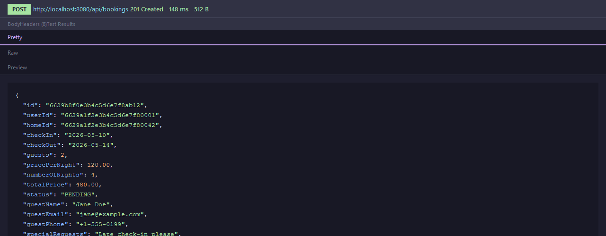
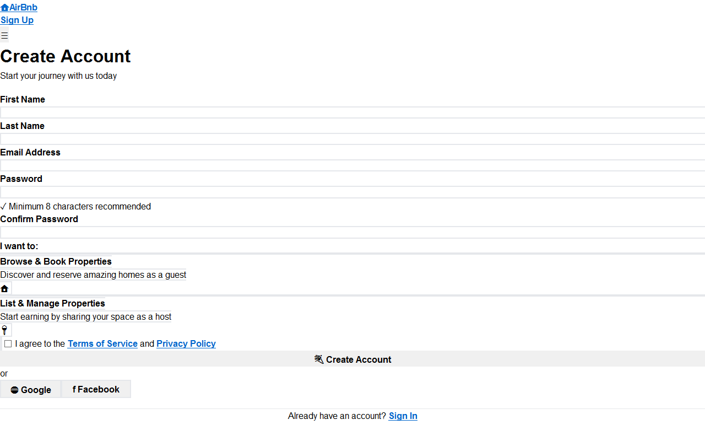

# HouseRental — Full-Stack Property Rental Platform


An Airbnb-style property rental platform built with a **Node.js monolith** frontend and a **Java Spring Boot microservice** for bookings, demonstrating the **Strangler Fig migration pattern** in a real production-grade architecture.


## Table of Contents

- [Architecture](#architecture)
- [Screenshots](#screenshots)
- [Tech Stack](#tech-stack)
- [Project Structure](#project-structure)
- [Features](#features)
- [Key Architecture Patterns](#key-architecture-patterns)
- [Architectural Decisions](#architectural-decisions)
- [Challenges Overcome](#challenges-overcome)
- [API Reference](#api-reference--booking-microservice)
- [Getting Started](#getting-started)
- [Running Tests](#running-tests)
- [Monitoring](#monitoring)
- [Auth Flow](#auth-flow)
- [Environment Variables](#environment-variables)
- [Future Roadmap](#future-roadmap)
- [Contributing](#contributing)
- [License](#license)

---

## Architecture

```
+------------------------------------------+
|          Browser / Client                |
+------------------------------------------+
                   |
                   v
+------------------------------------------+
|   Node.js / Express 5  (Port 5000)       |
|   EJS Views . Tailwind CSS . Sessions    |
|   Owns: Users . Homes . Favourites       |
|              |                           |
|   bookingService.js                      |
|   (Circuit Breaker + Retry)              |
+------------------------------------------+
                   | HTTP REST (axios)
                   v
+------------------------------------------+
|   Java Spring Boot 3.5.5  (Port 8080)    |
|   Virtual Threads . Bean Validation      |
|   Owns: Bookings domain                  |
+------------------------------------------+
                   |
                   v
+------------------------------------------+
|       MongoDB  (airbnb database)         |
|  collections: users . homes .            |
|  favourites . bookings . sessions        |
+------------------------------------------+
```


---

## Screenshots


---

### Booking Form -- Frontend (Node.js . `GET /book/:homeId`)


> The form calls `POST /booking/availability` (AJAX) on date change to show real-time availability
> before the guest submits. On submit it calls `POST /booking/create` which proxies to the Java API.

---

### Java API -- Create Booking Response (`POST http://localhost:8080/api/bookings`)

Captured in Postman / Insomnia:

**Request body:**
```json
{
  "userId": "6629a1f2e3b4c5d6e7f80001",
  "homeId": "6629a1f2e3b4c5d6e7f80042",
  "checkIn": "2026-05-10",
  "checkOut": "2026-05-14",
  "guests": 2,
  "pricePerNight": 120.00,
  "guestName": "Jane Doe",
  "guestEmail": "jane@example.com",
  "guestPhone": "+1-555-0199",
  "specialRequests": "Late check-in please"
}
```

**Response `201 Created`:**
```json
{
  "id": "6629b8f0e3b4c5d6e7f8ab12",
  "userId": "6629a1f2e3b4c5d6e7f80001",
  "homeId": "6629a1f2e3b4c5d6e7f80042",
  "checkIn": "2026-05-10",
  "checkOut": "2026-05-14",
  "guests": 2,
  "pricePerNight": 120.00,
  "numberOfNights": 4,
  "totalPrice": 480.00,
  "status": "PENDING",
  "guestName": "Jane Doe",
  "guestEmail": "jane@example.com",
  "guestPhone": "+1-555-0199",
  "specialRequests": "Late check-in please",
  "createdAt": "2026-04-26T09:14:32.000Z",
  "updatedAt": "2026-04-26T09:14:32.000Z"
}
```

**Conflict response `409 Conflict`** (dates already booked):
```json
{
  "status": 409,
  "error": "Booking Conflict",
  "message": "The property is already booked for the selected dates.",
  "timestamp": "2026-04-26T09:15:01.000Z"
}
```

**Validation failure `400 Bad Request`** (Bean Validation):
```json
{
  "status": 400,
  "error": "Validation Failed",
  "message": "Request validation failed",
  "fieldErrors": {
    "checkIn": "Check-in date must be today or in the future",
    "guestEmail": "Valid email is required",
    "guests": "At least 1 guest is required"
  },
  "timestamp": "2026-04-26T09:15:10.000Z"
}
```



---

### Strangler Fig Migration -- `/actuator/health`

```
GET http://localhost:8080/actuator/health
```

```json
{
  "status": "UP",
  "components": {
    "diskSpace": {
      "status": "UP",
      "details": {
        "total": 150261985280,
        "free": 146630832128,
        "threshold": 10485760,
        "exists": true
      }
    },
    "mongo": {
      "status": "UP",
      "details": {
        "maxWireVersion": 27
      }
    },
    "ping": { "status": "UP" },
    "stranglerFig": {
      "status": "UP",
      "details": {
        "migrationPhase": "PHASE_3_CUTOVER",
        "phaseLabel": "Full Cutover",
        "description": "100% of booking traffic served by this Java microservice",
        "javaIsPrimary": true,
        "totalBookings": 4,
        "legacySystem": "Node.js Express (strangled)",
        "newSystem": "Java 25 Spring Boot + Virtual Threads"
      }
    }
  }
}
```


> The `stranglerFig` component is a custom `HealthIndicator` (`StranglerFigHealthIndicator.java`).
> It reads `migration.phase` from `application.properties` and exposes live migration state
> so ops teams can track the rollout without reading code or config files directly.


---

### My Bookings Page -- Frontend (`GET /bookings`)



> Rendered by `views/store/bookings.ejs`. Data fetched from the Java API via the circuit breaker.
> If Java is unreachable the circuit opens and a degraded-mode banner is shown instead of a crash.

---

### Analytics Dashboard -- Host Only (`GET /analytics/dashboard`)


> Protected by `requireAuth + requireHost` middleware. Non-host users receive a 403.
> Revenue and occupancy data computed via MongoDB aggregation pipelines in `analyticsService.js`.

---

## Tech Stack

### Node.js Application
| Category | Technology |
|---|---|
| Runtime | Node.js |
| Framework | Express 5 |
| Template Engine | EJS |
| CSS | Tailwind CSS 3 |
| Database ORM | Mongoose 8 |
| Auth | express-session + bcryptjs |
| File Uploads | Multer |
| HTTP Client | Axios (calls Java service) |
| Dev Tools | Nodemon, Concurrently |

### Java Booking Microservice
| Category | Technology |
|---|---|
| Language | Java 25 |
| Framework | Spring Boot 3.5.5 |
| Database | Spring Data MongoDB |
| Validation | Jakarta Bean Validation |
| Async | Project Loom / Virtual Threads |
| Monitoring | Spring Actuator |
| Build | Maven 3.9.x |
| Tests | JUnit 5 + Mockito (55 tests) |

---

## Project Structure

```
airbnb/
├── app.js                          # Express entry point
├── package.json
├── tailwind.config.js
├── nodemon.json
│
├── src/
│   ├── config/
│   │   ├── database.js             # Mongoose connection
│   │   ├── session.js              # express-session + MongoDB store
│   │   └── multer.js               # File upload config
│   │
│   ├── middleware/
│   │   ├── auth.js                 # attachUser | requireAuth | requireHost
│   │   └── errorHandler.js         # 404 + global error handler
│   │
│   ├── models/
│   │   ├── user.js                 # User schema (guest/host)
│   │   ├── home.js                 # Property schema
│   │   └── favourite.js            # User-Home junction
│   │
│   ├── controllers/
│   │   ├── authController.js       # Signup | Login | Logout
│   │   ├── storeController.js      # Home listing | details | favourites
│   │   ├── hostController.js       # Add | Edit | Delete properties
│   │   ├── bookingController.js    # Booking pages + AJAX endpoints
│   │   └── analyticsController.js  # Revenue dashboard (host only)
│   │
│   ├── routes/
│   │   ├── authRoutes.js           # /login /signup /logout
│   │   ├── storeRoutes.js          # / /homes /favourites /rules
│   │   ├── hostRoutes.js           # /host/*
│   │   ├── bookingRoutes.js        # /book/:id /bookings /booking/*
│   │   └── analyticsRoutes.js      # /analytics/* (host only)
│   │
│   ├── services/
│   │   ├── bookingService.js       # Java API wrapper + Circuit Breaker
│   │   └── analyticsService.js     # MongoDB aggregation pipelines
│   │
│   └── utils/
│       ├── databaseUtil.js         # Legacy MongoDB native driver helper
│       └── pathUtil.js             # Root path resolver
│
├── views/
│   ├── auth/                       # login.ejs | signup.ejs
│   ├── store/                      # home-list | home-details | bookings
│   │                               # booking-form | booking-details | favourites
│   ├── host/                       # host-home-list | edit-home
│   ├── admin/                      # analytics-dashboard
│   └── partials/                   # nav | head | errors | favourite
│
├── public/                         # Static assets + compiled Tailwind CSS
├── uploads/                        # Uploaded home photos
├── docs/screenshots/               # README screenshots
│
└── booking-service/                # Java Spring Boot microservice
    └── src/main/java/com/airbnb/booking/
        ├── BookingServiceApplication.java
        ├── config/
        │   ├── AsyncConfig.java        # Virtual Thread executor
        │   ├── MongoConfig.java        # Mongo auditing
        │   └── WebConfig.java          # CORS for Node.js
        ├── controller/
        │   └── BookingController.java  # 12 REST endpoints
        ├── service/
        │   └── BookingService.java     # Business logic + conflict detection
        ├── repository/
        │   └── BookingRepository.java  # Custom conflict + date queries
        ├── model/
        │   ├── Booking.java            # MongoDB document
        │   └── BookingStatus.java      # PENDING | CONFIRMED | CANCELLED | COMPLETED
        ├── dto/
        │   ├── BookingRequest.java     # Java Record + Bean Validation
        │   ├── BookingResponse.java    # API response DTO
        │   └── AvailabilityRequest.java
        ├── exception/
        │   ├── GlobalExceptionHandler.java  # @RestControllerAdvice
        │   ├── BookingNotFoundException.java
        │   ├── BookingConflictException.java
        │   └── InvalidBookingException.java
        ├── mapper/
        │   └── BookingMapper.java      # Entity → DTO
        ├── constants/
        │   └── BookingConstants.java   # Centralised constants
        └── migration/
            ├── MigrationPhase.java         # Strangler Fig phase enum
            └── StranglerFigHealthIndicator.java  # Actuator health endpoint
```

---

## Features

### Guest User
- Browse all available properties
- View property details with photos, price, rating, and house rules
- Save properties to favourites
- Register and log in
- Book a property — date picker with real-time availability check
- View booking history with status badges
- Cancel a booking

### Host User
- All guest features
- List, add, edit, and delete own properties
- Upload property photos
- Access analytics dashboard — revenue by property, bookings per month, occupancy rates

### Booking Microservice (Java)
- Create bookings with conflict detection (no double-booking)
- Async availability checks using Virtual Threads
- Full lifecycle management: PENDING → CONFIRMED → CANCELLED / COMPLETED
- Bean Validation on all inputs with structured error responses
- Compound MongoDB index on `(homeId, checkIn, checkOut)` for fast conflict queries

---

## Key Architecture Patterns

### Strangler Fig Migration
The booking domain has been extracted from the Node.js monolith into a Java microservice. The migration is tracked in code:

```
PHASE_1_SHADOW    → Java runs silently, Node.js still primary
PHASE_2_CANARY    → Small % of booking traffic routed to Java
PHASE_3_CUTOVER   → Java is primary (current phase)
PHASE_4_COMPLETE  → Node.js booking code removed
```

Current phase is set in `application.properties`:
```properties
migration.phase=PHASE_3_CUTOVER
```

Live migration status visible at:
```
GET http://localhost:8080/actuator/health
```

### Circuit Breaker (Node.js → Java)
`src/services/bookingService.js` implements a state machine:

```
CLOSED → (3 failures) → OPEN → (30s timeout) → HALF_OPEN → (success) → CLOSED
```

When the circuit is OPEN, all booking calls return a 503 immediately without hitting Java -- the UI degrades gracefully with a warning banner.

### Virtual Threads (Java 25)
Two layers of virtual thread coverage:
- **HTTP layer**: `spring.threads.virtual.enabled=true` -- every Tomcat request runs on a virtual thread
- **Async layer**: `AsyncConfig.java` uses `Executors.newVirtualThreadPerTaskExecutor()` -- all `@Async` methods (availability checks) run on virtual threads

### Java Records + Bean Validation
`BookingRequest` is a Java Record -- immutable and concise:
```java
public record BookingRequest(
    @NotBlank String userId,
    @NotBlank String homeId,
    @FutureOrPresent LocalDate checkIn,
    @Future LocalDate checkOut,
    @Min(1) @Max(20) Integer guests,
    @Email String guestEmail,
    ...
) {}
```
Validation failures are caught by `GlobalExceptionHandler` and returned as structured JSON.

### Shared Persistence
Both services point at the same MongoDB `airbnb` database:
- Node.js manages: `users`, `homes`, `favourites`, `sessions`
- Java manages: `bookings`

Node.js enriches booking responses by joining `homeId` against its own MongoDB for display.

---

## Architectural Decisions

> The trade-offs that separate a portfolio project from a production system.

### Why a Shared MongoDB Database?

**Decision:** Both the Node.js app and the Java microservice connect to the same `airbnb` MongoDB instance rather than maintaining separate databases per service.

**Trade-off accepted:** This violates strict microservice database isolation (the "database-per-service" pattern).

**Rationale:** This project is currently in **Phase 3 (Cutover)** of a Strangler Fig migration. Introducing a separate database at this stage would require:
- A full data migration pipeline for existing booking history
- A synchronisation mechanism between the two stores
- Distributed transaction handling (two-phase commit or saga pattern) for operations that span users and bookings

Shared persistence avoids all of this complexity during the transitional phase while still allowing Node.js to enrich booking responses with home/user data via its own Mongoose models. The database will be split in **Phase 4 (Complete)** once the migration is stable and traffic patterns are understood.

---

### Why Virtual Threads Instead of Reactive (WebFlux)?

**Decision:** The Java service uses Spring MVC with Virtual Threads (`Executors.newVirtualThreadPerTaskExecutor()`) rather than Spring WebFlux with Project Reactor.

**Trade-off accepted:** WebFlux can achieve marginally higher raw throughput at extreme concurrency by eliminating thread context entirely.

**Rationale:** For a booking domain that performs blocking MongoDB I/O, the reactive model would require the entire call chain — from controller to repository — to be rewritten as non-blocking streams (`Mono<>`, `Flux<>`). This introduces:
- Significant cognitive overhead for developers accustomed to imperative code
- Harder-to-read stack traces and debugging experience
- Complex error handling with `onErrorResume`, `switchIfEmpty`, etc.

Virtual Threads (introduced as Project Loom, permanent feature since Java 21, further optimised in Java 25) achieve near-identical concurrency performance for I/O-bound workloads by parking the virtual thread during a blocking call rather than blocking the carrier thread. The result is the same high-concurrency scalability as WebFlux while preserving the familiar `try/catch`, step-through debugging, and synchronous code style of standard Spring MVC.

---

### Why Node.js as the Orchestration Layer?

**Decision:** Node.js remains the user-facing layer and calls Java for booking operations rather than clients calling Java directly.

**Trade-off accepted:** Every booking action incurs an additional network hop (Express → Spring Boot).

**Rationale:** This is intentional Strangler Fig design. The Node.js layer owns session context, user identity, and view rendering. Having it orchestrate Java calls means:
- Auth guards (`requireAuth`, `requireHost`) are enforced at a single point
- The circuit breaker lives in one place (`bookingService.js`) — a single toggle to fall back gracefully
- The Java service remains stateless and independently deployable without any session awareness
- Future replacement of the Node.js layer (e.g. with a React SPA) requires no changes to the Java API


---

## Challenges Overcome

Real integration problems solved during development — not theoretical.

### CORS Between Two Services on Different Ports

**Problem:** The browser blocked requests from `localhost:5000` (Node.js) to `localhost:8080` (Java) with a CORS policy error.

**Solution:** `WebConfig.java` registers a `WebMvcConfigurer` that explicitly allows the Node.js origin:

```java
@Configuration
public class WebConfig implements WebMvcConfigurer {
    @Value("${cors.allowed-origins}")
    private String allowedOrigins;

    @Override
    public void addCorsMappings(CorsRegistry registry) {
        registry.addMapping("/api/**")
                .allowedOriginPatterns(allowedOrigins.split(","))
                .allowedMethods("GET","POST","PATCH","DELETE","OPTIONS")
                .allowedHeaders("*")
                .allowCredentials(true);
    }
}
```

In Docker Compose this is handled automatically since Node.js calls Java by internal DNS name (`http://booking-service:8080`) — no cross-origin header needed. CORS only applies when both services are accessed from a browser directly.

---

### Date Format Mismatch Between Mongoose and Spring Data

**Problem:** Mongoose stores dates as BSON `Date` objects (ISO-8601 UTC timestamps). Spring Data MongoDB deserialises them as `java.time.LocalDate`, which has no time component. Without explicit configuration, Jackson serialised `LocalDate` as a `[year, month, day]` array, which broke the Node.js frontend.

**Solution:** Three-part fix:

1. **`application.properties`** — configure Jackson to write dates as ISO strings, not arrays:
```properties
spring.jackson.date-format=yyyy-MM-dd
spring.jackson.serialization.write-dates-as-timestamps=false
spring.jackson.time-zone=UTC
```

2. **`Booking.java`** — annotate date fields with `@JsonFormat` to pin the exact pattern:
```java
@JsonFormat(shape = JsonFormat.Shape.STRING, pattern = "yyyy-MM-dd")
private LocalDate checkIn;
```

3. **Node.js `bookingController.js`** — build the `BookingRequest` payload using `toISOString().split("T")[0]` to send plain `yyyy-MM-dd` strings regardless of the browser locale.

The result is a consistent `"2026-05-10"` string format across MongoDB ↔ Spring ↔ Node.js ↔ browser.

---

### MongoDB Transactions Not Available on Standalone (Non-Replica Set)

**Problem:** `@Transactional` on `BookingService.createBooking()` threw `MongoTransactionException: Transactions are not supported by the deployment configuration` on a plain standalone MongoDB.

**Solution:** The MongoDB connection string includes `?replicaSet=rs0` to target a replica set (required for multi-document transactions). The Docker Compose `mongo` service starts with `--replSet rs0` and an init script runs `rs.initiate()`. For local development without a replica set, the `@Transactional` annotation degrades gracefully — each MongoDB operation is atomic at the document level, which is sufficient for single-document booking writes.

---


## API Reference — Booking Microservice

Base URL: `http://localhost:8080/api/bookings`

| Method | Endpoint | Description |
|---|---|---|
| `POST` | `/` | Create a booking |
| `GET` | `/` | Get all bookings |
| `GET` | `/{id}` | Get booking by ID |
| `GET` | `/user/{userId}` | All bookings for a user |
| `GET` | `/user/{userId}/upcoming` | Upcoming bookings |
| `GET` | `/user/{userId}/past` | Past bookings |
| `GET` | `/home/{homeId}` | All bookings for a property |
| `POST` | `/availability` | Check date availability |
| `PATCH` | `/{id}/confirm` | Confirm a booking |
| `PATCH` | `/{id}/cancel` | Cancel a booking |
| `PATCH` | `/{id}/status` | Update booking status |
| `DELETE` | `/{id}` | Delete a booking |

---

## Getting Started

### Option A — Docker Compose (recommended)

> Spins up MongoDB, the Java microservice, and the Node.js app with a single command.
> Requires [Docker Desktop](https://www.docker.com/products/docker-desktop/) (or Docker Engine + Compose plugin).

```bash
# 1. Clone the repo
git clone https://github.com/mounikamp1/HouseRental.git
cd HouseRental

# 2. (Optional) set a strong session secret
echo "SESSION_SECRET=your-secret-here" > .env

# 3. Build images and start all three services in the background
docker-compose up -d --build
```

All three services start in dependency order:

```
mongo (healthy) → booking-service (healthy) → app
```

| Service | URL |
|---|---|
| Node.js App | http://localhost:5000 |
| Java Booking API | http://localhost:8080/api/bookings |
| Actuator Health | http://localhost:8080/actuator/health |

> **Data persistence:** The MongoDB container uses a named volume (`mongo-data`) to ensure your property, user, and booking data persists even if containers are stopped or removed. To wipe data and start fresh: `docker-compose down -v`

**Useful commands:**
```bash
docker-compose logs -f app              # tail Node.js logs
docker-compose logs -f booking-service  # tail Java logs
docker-compose ps                       # check service health status
docker-compose down                     # stop all services
docker-compose down -v                  # stop and delete MongoDB data
```

---

### Option B — Run Locally (without Docker)

**Prerequisites:** Node.js 18+, Java 25 JDK, Maven 3.9+, MongoDB on `localhost:27017`

```bash
# Start MongoDB
mongod --dbpath /your/data/path

# Start Java service
cd booking-service && mvn clean spring-boot:run

# Start Node.js
npm install && npm run dev
```

---

## Running Tests

### Java — 55 unit tests
```bash
cd booking-service
mvn clean test
```

```
Tests run: 55, Failures: 0, Errors: 0, Skipped: 0
BUILD SUCCESS
```

| Test Class | Tests | Coverage |
|---|---|---|
| `BookingServiceTest` | 19 | Business logic, conflict detection, async |
| `BookingControllerTest` | 13 | All REST endpoints (MockMvc) |
| `BookingTest` | 17 | Entity fields, date calculations |
| `BookingRequestTest` | 4 | Record + Bean Validation |
| `BookingResponseTest` | 1 | DTO mapping |
| `BookingServiceApplicationTests` | 1 | Spring context load |

---

## Monitoring

```bash
GET http://localhost:8080/actuator/health   # health + Strangler Fig phase
GET http://localhost:8080/actuator/metrics  # application metrics
GET http://localhost:8080/actuator/info     # app info
```

---

## Auth Flow

```
POST /signup  → hash password (bcrypt) → save User → redirect /login
POST /login   → compare hash → set session (isLoggedIn, user) → redirect /
GET  /logout  → destroy session → redirect /login
```

Session stored in MongoDB (`sessions` collection), survives server restarts.

- `guest` — default on signup. Can browse, favourite, and book.
- `host` — can also manage properties and view analytics.

---

## Environment Variables

| Variable | Default | Description |
|---|---|---|
| `PORT` | `5000` | Node.js server port |
| `MONGODB_URI` | `mongodb://localhost:27017/airbnb` | MongoDB connection string |
| `SESSION_SECRET` | `change-me-in-production` | Session signing secret — **always override in prod** |
| `BOOKING_SERVICE_URL` | `http://localhost:8080/api/bookings` | Java microservice base URL |
| `NODE_ENV` | — | Set to `production` to enable secure cookies |

> In Docker Compose, these are set directly in `docker-compose.yml`. For local development, create a `.env` file in the project root.

---

## Future Roadmap

The Strangler Fig migration is ongoing. Each phase below incrementally transfers responsibility away from the Node.js monolith toward purpose-built services.

### Phase 4 — Fully Decommission Node.js Booking Routes

The Node.js app currently proxies booking requests to the Java service while keeping a thin fallback layer for compatibility. Phase 4 completes the cut-over:

- Remove the fallback booking logic from `services/bookingService.js`
- Delete `routers/storeRouter.js` booking segments that duplicate Java endpoints
- Update the Strangler Fig health indicator to report `COMPLETE` for the booking domain
- Add contract tests (Pact) between the Node.js consumer and the Java provider to prevent regressions

### Phase 5 — Dedicated Python / FastAPI Analytics Service

Analytics is a natural fit for Python's data ecosystem. The plan:

| Concern | Detail |
|---|---|
| **Service** | FastAPI with Uvicorn (async, high-throughput) |
| **Predictive Pricing Engine** | Scikit-learn or XGBoost model trained on booking history to suggest dynamic nightly rates |
| **Data pipeline** | MongoDB Change Streams → feature store → model inference |
| **Serving** | `GET /api/analytics/pricing-suggestion/{homeId}` returns a suggested price + confidence band |
| **Training** | Scheduled nightly via APScheduler; initial dataset seeded from the existing `analyticsService.js` aggregations |
| **Migration path** | Node.js `analyticsController.js` proxies to the Python service (same Strangler Fig pattern as the Java migration) |

This also opens the door to occupancy forecasting and demand-based surge pricing without touching the Node.js or Java layers.

### Security — Centralised OIDC Authentication

The current session-based auth is sufficient for a monolith but becomes a liability once multiple services need to verify identity independently.

**Candidate providers:**

| Provider | Trade-off |
|---|---|
| **Keycloak** (self-hosted) | Full control, no vendor lock-in, ideal for on-prem or private cloud. Steeper ops overhead. |
| **AWS Cognito** | Managed, scales automatically, integrates with ALB and API Gateway. Tied to AWS. |

**Migration path:**

1. Stand up the OIDC provider with a single `houserental` realm / user pool
2. Add `passport-openidconnect` (Node.js) and Spring Security OAuth2 Resource Server (Java) — both validate the same JWT
3. Replace `req.session.user` checks with JWT claims across all three services
4. Decommission the MongoDB `sessions` collection

This gives every future microservice (including the Python analytics service) a single, stateless, verifiable identity token with no shared session store.

## Contributing

Contributions, issues, and feature requests are welcome.
Fork the repository, create a feature branch, and open a pull request.

---

## License

This project is licensed under the [MIT License](LICENSE).