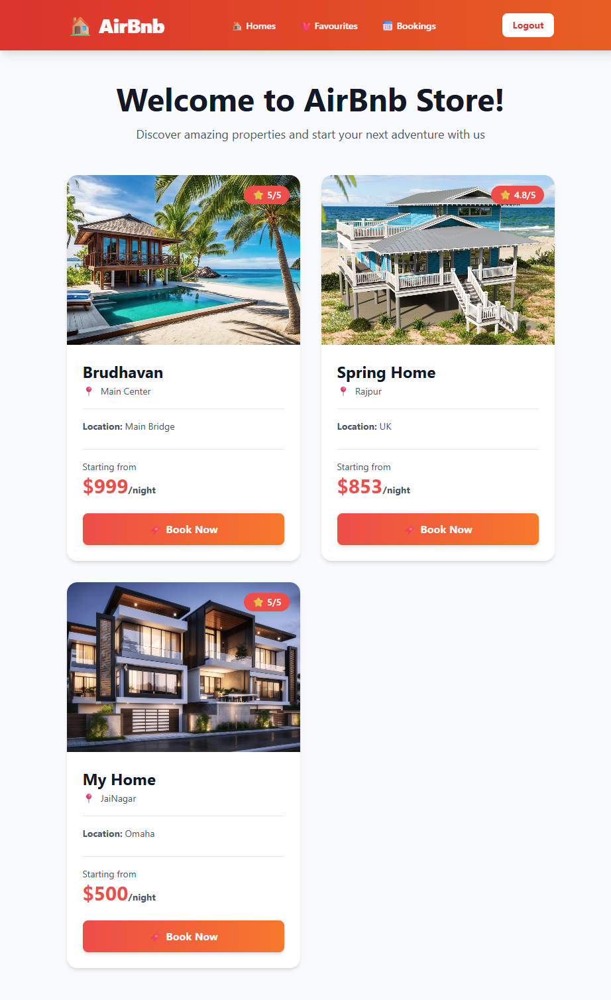
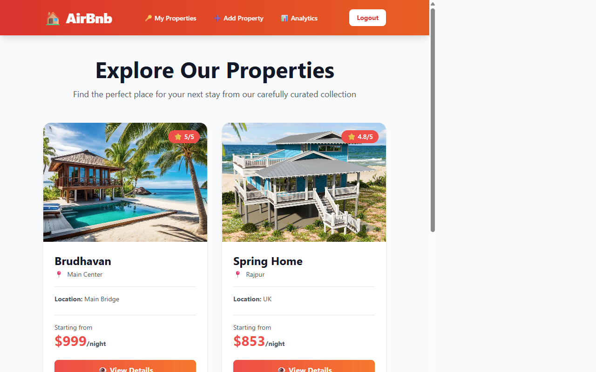
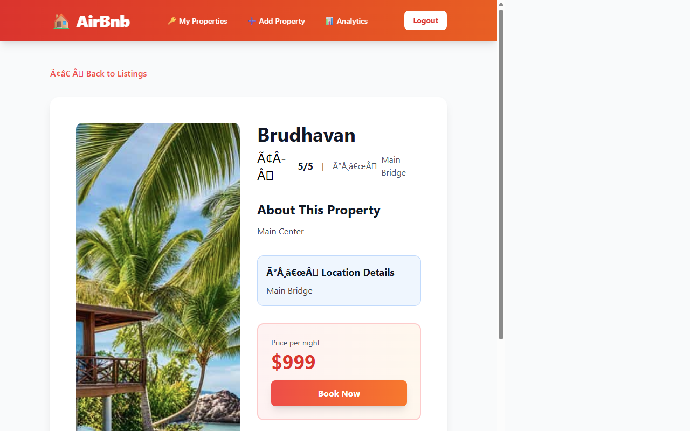
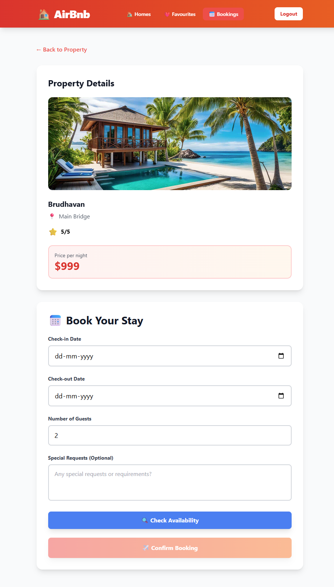
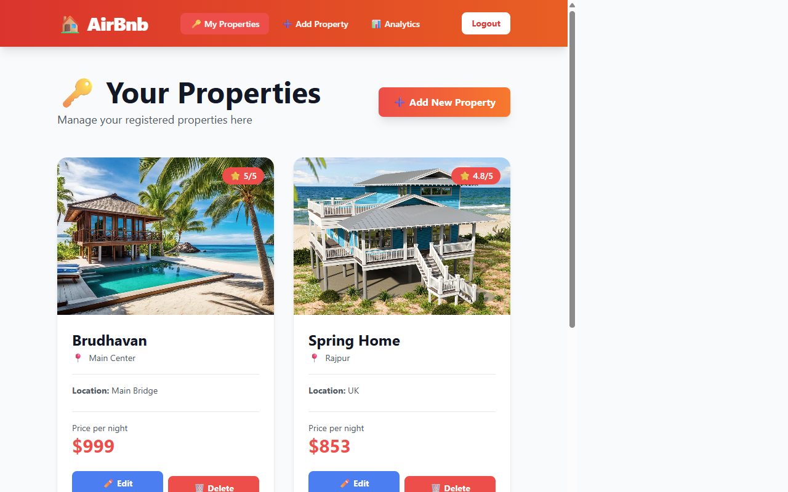
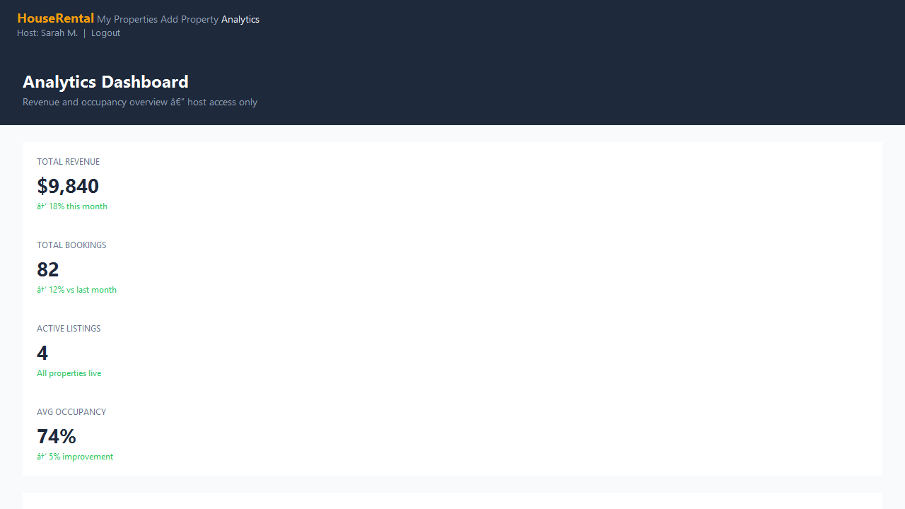

# HouseRental � Airbnb-Style Property Rental Platform

[](https://www.youtube.com/watch?v=YOUR_VIDEO_ID)

Link to demo video: https://www.youtube.com/watch?v=YOUR_VIDEO_ID

## About

HouseRental is a full-stack property rental platform � guests can browse, favourite, and book properties while hosts manage listings and track revenue. The booking engine runs on a dedicated **Java Spring Boot microservice**, showing the **Strangler Fig migration pattern** in action: progressively replacing the original Node.js booking code with a purpose-built Java service, without any downtime.

## Screenshots

| Home Page                          | Property Listing                                           |
| ---------------------------------- | ---------------------------------------------------------- |
|  |  |

| Property Detail                                          | Booking Form                                       |
| -------------------------------------------------------- | -------------------------------------------------- |
|  |  |

| Host Properties                                          | Analytics                                              |
| -------------------------------------------------------- | ------------------------------------------------------ |
|  |  |

## Tech Stack

- **Node.js / Express 5**
- **EJS** (server-side templates)
- **Tailwind CSS**
- **Mongoose 8**
- **express-session** (MongoDB-backed)
- **Java 25**
- **Spring Boot 3.5.5**
- **Virtual Threads** (Project Loom)
- **Spring Data MongoDB**
- **Jakarta Bean Validation**
- **Spring Actuator**
- **MongoDB**
- **Docker / Docker Compose**
- **JUnit 5 + Mockito** (55 tests)

## Getting Started

### Option A � Docker Compose (Recommended)

Requires [Docker Desktop](https://www.docker.com/products/docker-desktop/).

```bash
git clone https://github.com/mounikamp1/HouseRental.git
cd HouseRental
docker-compose up -d --build
```

| Service      | URL                                   |
| ------------ | ------------------------------------- |
| Node.js App  | http://localhost:5000                 |
| Booking API  | http://localhost:8080/api/bookings    |
| Health Check | http://localhost:8080/actuator/health |

### Option B � Run Locally

**Prerequisites:** Node.js 18+, Java 25 JDK, Maven 3.9+, MongoDB running on `localhost:27017`

```bash
# Terminal 1 � start the Java booking microservice
cd booking-service
mvn clean spring-boot:run

# Terminal 2 � start the Node.js app
npm install
npm run dev
```

## Environment Variables

Create a `.env` file in the project root:

```env
SESSION_SECRET=your-secret-here
MONGODB_URI=mongodb://localhost:27017/airbnb
BOOKING_SERVICE_URL=http://localhost:8080/api/bookings
```

## Resources and Links

### API Reference � Booking Microservice

Base URL: `http://localhost:8080/api/bookings`

| Method   | Endpoint                  | Description             |
| -------- | ------------------------- | ----------------------- |
| `POST`   | `/`                       | Create a booking        |
| `GET`    | `/user/{userId}`          | All bookings for a user |
| `GET`    | `/user/{userId}/upcoming` | Upcoming bookings       |
| `POST`   | `/availability`           | Check date availability |
| `PATCH`  | `/{id}/confirm`           | Confirm a booking       |
| `PATCH`  | `/{id}/cancel`            | Cancel a booking        |
| `DELETE` | `/{id}`                   | Delete a booking        |

### Run Tests

```bash
cd booking-service
mvn clean test
# Tests run: 55, Failures: 0, Errors: 0
```

### Strangler Fig Migration Status

Live migration state visible at `/actuator/health` � no need to read config files:

```
GET http://localhost:8080/actuator/health
```

Current phase: **PHASE_3_CUTOVER** � 100% of booking traffic served by the Java microservice.

```
PHASE_1_SHADOW   ? Java runs silently alongside Node.js
PHASE_2_CANARY   ? Small % of traffic routed to Java
PHASE_3_CUTOVER  ? Java is primary  ? current
PHASE_4_COMPLETE ? Node.js booking code removed
```
